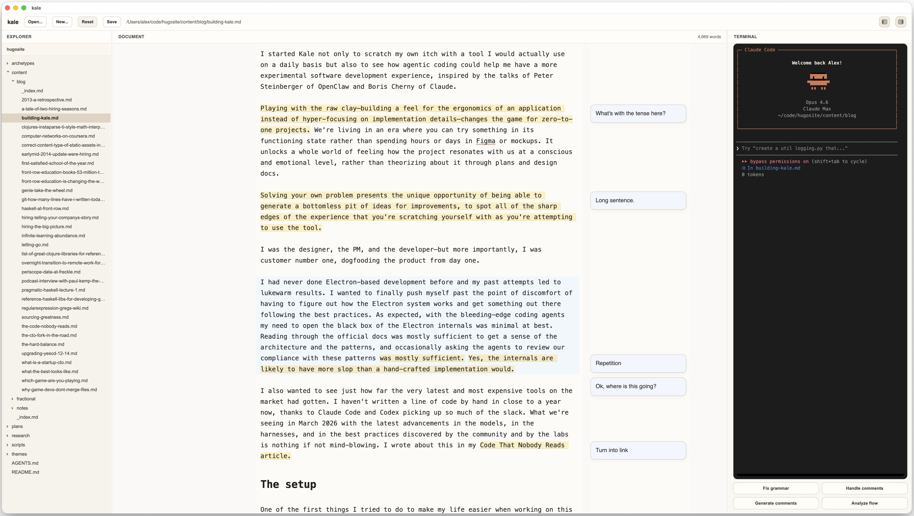

# kale

An agentic word processor for technical essay writers. Combines the aesthetics of the best writing tools with the power of Claude Code, git, and Markdown.

Annotate your draft with comments — "find a link for this claim", "this paragraph reads clunky", "is this actually true?" — and Claude acts on them when you're ready. Or let Claude generate comments as an editor and writing coach, helping you refine your prose.

Kale integrates with Claude Code through its IDE MCP server (activated with `/ide`) and lets you select lines for Claude to focus on, the same way VS Code and Cursor do.

Born from the workflow behind [kuril.in](https://www.kuril.in/), packaged into the tool I wished existed.

## Technology

This repository is an Electron Forge + Vite + TypeScript (v5.9.3) desktop app with a React renderer shell.

## Run Commands

- Start in development: `npm start`
- Start in development with a custom window size: `KALE_WINDOW_WIDTH=1800 KALE_WINDOW_HEIGHT=1100 npm start`
- Capture a screenshot of an already-running `kale` Electron window into `/tmp` as a JPG: `scripts/capture_npm_start_window.sh` (optional args: capture delay seconds, output path). The script prints the generated file path.
- Run unit tests: `npm test`
- Run unit tests in watch mode: `npm run test:watch`
- Run E2E test (builds the app first): `npm run test:e2e`
- Format files: `npm run format`
- Check formatting: `npm run format:check`
- Lint: `npm run lint`
- Package app: `npm run package`
- Build distributables: `npm run make`

## Git Hooks (Local)

This repo includes a local pre-commit hook at `.githooks/pre-commit` that formats/lints staged files with `lint-staged` (including `shellcheck` for shell scripts) and runs `gitleaks` against staged changes to catch accidental secret commits before they enter git history.

- Enable repo-managed hooks once per clone: `git config core.hooksPath .githooks`
- Install dependencies (includes local `lint-staged`): `npm install`
- Install `gitleaks` locally (for example via Homebrew): `brew install gitleaks`
- Install `shellcheck` locally (for example via Homebrew): `brew install shellcheck`
- Hook flow: `lint-staged` (staged format/lint + shellcheck for `*.sh`) -> `gitleaks` (staged secret scan)
- Verify manually on staged changes: `gitleaks git . --staged --no-banner --redact`

**Notes:**
- The script runs Electron directly (`./node_modules/.bin/electron .vite/build/main.js`) rather than through `electron-forge start`, which requires a TTY to stay alive.
- `ws` and `node-pty` are Vite externals, so the Electron binary must run from the project root where `node_modules` is available.
- The CDP port defaults to 9222 and can be overridden with the `KALE_CDP_PORT` env var in the script.
- DevDependency: `playwright` must be installed (`npm install playwright --save-dev`).

## E2E Testing

The E2E test (`tests/e2e/happy-path.js`) launches the full Electron app via Playwright's `_electron.launch()`, types a paragraph, adds an inline comment, waits for autosave, and verifies both the paragraph and comment markers are persisted on disk.

- Run: `npm run test:e2e` (builds the app first, then runs the test)
- The test creates an isolated temporary `userData` directory so it never touches your real app state.
- Three environment variables control E2E-relevant behavior:
  - `KALE_HEADLESS=1` — hides the BrowserWindow and suppresses DevTools.
  - `KALE_SKIP_TERMINAL_VALIDATION=1` — skips the Claude CLI startup check (not needed for editor tests, and unavailable in CI).
  - `KALE_USER_DATA_DIR=<path>` — overrides the Electron `userData` directory for state isolation.
- **Linux CI (GitHub Actions):** Electron requires a display even with `show: false`. Wrap the test with `xvfb-run -a npm run test:e2e`.

## Folder Overview

- `src/`: application source code for the Electron main process, preload layer, and renderer entry.
- `src/main.ts`: Electron main-process orchestrator that wires lifecycle events to extracted domain services.
- `src/main/`: main-process domain modules for window creation, markdown file/watcher IPC, terminal PTY sessions, and Claude Code IDE integration.
- `src/preload.ts`: preload bridge that exposes typed `markdownApi`, `terminalApi`, and `ideServerApi` methods/events to the renderer via `contextBridge`.
- `src/shared-types.ts`: canonical IPC payload/type contracts shared by main, preload, renderer, and IDE integration code.
- `src/renderer/main.tsx`: renderer entry that mounts the React app shell.
- `src/renderer/`: extracted renderer modules for CodeMirror extensions, save/autosave controller logic, line-level three-way merge, and typed IPC API wrappers (`markdown-api.ts`, `terminal-api.ts`, `ide-server-api.ts`) that the React components use to talk to the main process.
- `src/renderer/App.tsx`: main React app shell that composes the document editor, terminal pane, and file-operation chrome.
- `src/renderer/DocumentCommentsPane.tsx`: document editor + inline comments orchestration (selection comment action, anchor-based floating comment layout/packing, sidebar wiring, autofocus handoff).
- `src/renderer/MarkdownEditorPane.tsx`: imperative CodeMirror wrapper that exposes editor content and range-anchor geometry to the React layout layer.
- `src/renderer/InlineCommentsSidebar.tsx`: presentational floating comments rail renderer (absolute-positioned card slots in the right column).
- `src/renderer/InlineCommentCard.tsx`: individual comment card UI (textarea auto-size, delete action, autofocus, resize reporting for layout).
- `src/renderer/line-merge.ts`: pure line-level three-way merge function for reconciling concurrent user and external (Claude) edits to the same document. Uses `node-diff3`; conflicts resolve in favor of the disk version.
- `src/renderer/inline-comments.ts`: parser/helpers for hidden HTML comment markers used as the canonical inline-comment source of truth.
- `src/renderer/TerminalPane.tsx`: reusable embedded PTY terminal pane component used by the main app, including preset prompt buttons that inject common Claude requests into the active terminal session and submit them automatically.
- `docs/`: product and architecture documentation (requirements, decisions, planning notes).
- `docs/todos.md`: tracked known issues and deferred fixes.
- `mockups/`: static UI mockups/prototypes used to explore interaction and visual direction.
- `prompts/`: runtime prompt assets (including the Claude appended system prompt used by the terminal session launcher).
- `data/`: example markdown files the app can edit
- `src/ide-server/`: MCP-over-WebSocket server that lets Claude Code CLI query Kale's editor state (open files, selections, diagnostics). See `docs/claude-code-ide-protocol.md` for the protocol spec.
- `src/types/`: ambient TypeScript declarations for packages whose types cannot be resolved by `moduleResolution: "node"`.
- `tests/e2e/`: Playwright-based end-to-end tests that launch the full Electron app and verify user-facing workflows.
- `AGENTS.md`: repository-specific agent instructions (with `CLAUDE.md` symlinked to it at the repo root).

## Main Process Architecture

The Electron main process is now organized as a thin orchestrator plus domain services:

- `src/main.ts` wires Electron lifecycle events (`ready`, `activate`, `window-all-closed`) to service startup/shutdown and IPC registration.
- `src/main/window.ts` owns BrowserWindow creation and Forge/Vite renderer/preload entry loading.
- `src/main/markdown-file-service.ts` owns active markdown file state, settings persistence, file open/load/save/restore IPC handlers, and chokidar-based file watching/broadcasts.
- `src/main/terminal-session-service.ts` owns PTY session state, Claude CLI startup validation/prompt-template preload, and terminal IPC handlers.
- `src/main/ide-integration-service.ts` owns IDE MCP server lifecycle, cached editor selection state, and the `ide:selection-changed` IPC handler/debounced Claude notifications.

Cross-service coordination stays explicit through small APIs/callbacks (for example, terminal and IDE services read the active file path from the markdown file service) rather than through a single shared runtime-state object.

## File Sync Architecture

The editor and the filesystem stay in sync through content-based comparison rather than timing heuristics:

1. **Save path**: user types → save controller debounces (5s) → writes to disk via IPC.
2. **File watcher**: main process uses chokidar to watch the active file and broadcasts every change to the renderer (150ms debounce for deduplication only).
3. **Self-save detection**: when a file-change notification arrives, the renderer compares the disk content to `saveController.getLastSavedContent()`. If they match, the notification is the echo-back from the app's own save and is ignored.
4. **External change with three-way merge**: if the disk content differs from the last saved content, a genuine external change occurred. When the editor has unsaved user edits, `mergeDocumentLines(base, ours, theirs)` reconciles both sets of changes at line granularity — non-conflicting edits from both sides are preserved, and conflicts resolve in favor of the disk version (external wins). If the merge preserved user edits, a save is scheduled automatically to persist the merged result.
5. **Post-replacement save sync**: `markContentAsSavedFromLoad` runs after the CodeMirror dispatch (not before), so any save timers created by keystrokes during the async reload gap are cleared at the right moment. When a merge produced content that differs from disk, the save controller's `lastSavedContent` is set to the actual disk content so it correctly detects the merged editor content as dirty.

## Claude Code IDE Integration

Kale runs an MCP (Model Context Protocol) server over WebSocket so Claude Code CLI can query editor state — open files, text selections, and diagnostics. The protocol is documented in `docs/claude-code-ide-protocol.md`.

**How it works:**

1. On startup, the main process starts a WebSocket server on a random port (10000–65535) bound to `127.0.0.1`.
2. A lock file is written to `~/.claude/ide/<port>.lock` containing the PID, workspace folders, IDE name ("Kale"), and an auth token (UUID).
3. Claude Code CLI discovers the server by scanning the lock file directory and connects with the auth token in an HTTP header.
4. The server exposes MCP tools: `getCurrentSelection`, `getLatestSelection`, `getOpenEditors`, `getDiagnostics`.
5. The renderer pushes selection changes to main via IPC; main caches the latest state and broadcasts `selection_changed` notifications to connected clients (50ms debounce). Claude Code consumes the selection context on prompt submission — this is standard behavior across all IDE integrations.
6. On shutdown, the server closes all connections and removes the lock file.
