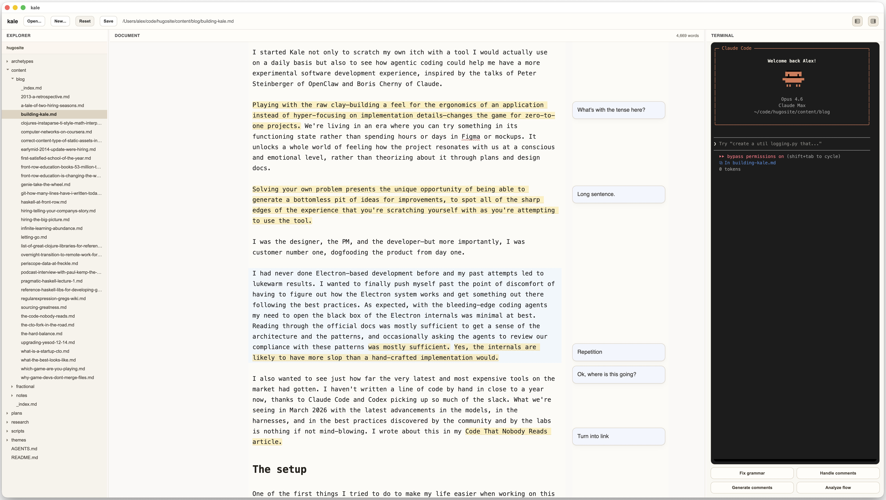

# kale

An agentic word processor for technical essay writers. Combines the aesthetics of the best writing tools with the power of Claude Code, git, and Markdown.

Annotate your draft with comments — "find a link for this claim", "this paragraph reads clunky", "is this actually true?" — and Claude acts on them when you're ready. Or let Claude generate comments as an editor and writing coach, helping you refine your prose.

Kale integrates with Claude Code through its IDE MCP server (activated with `/ide`) and lets you select lines for Claude to focus on, the same way VS Code and Cursor do.

Born from the workflow behind [kuril.in](https://www.kuril.in/), packaged into the tool I wished existed.

## Technology

This repository is an Electron Forge + Vite + TypeScript (v5.9.3) desktop app with a React renderer shell.

## Workspace Layout

- The top bar includes a terminal pane toggle button (top-right) with Cursor-style active/inactive states:
  - active/lit = terminal pane expanded
  - dim = terminal pane collapsed
- The top bar now includes git-aware file controls:
  - `Restore Git` restores the current file to `HEAD` and discards local edits after confirmation.
  - `Branch` dropdown lists local branches for the active file's repository and always reflects the current branch (including detached `HEAD` labeling).
  - Switching branches prompts a confirmation modal (`Yes` / `Cancel`) when the current file has unsaved editor edits or git-detected local modifications.
  - `Save` flushes editor edits, then runs `git add` + `git commit` for the active file only in that file's own git repository using a stock message: `Edits to <filename>`.
- Collapsing the terminal hides the right pane and keeps the editor as the primary writing surface.
- The terminal pane stays mounted while collapsed, so the underlying PTY session remains alive and is restored instantly when expanded.
- Toggling collapse/expand automatically resizes the native window width by the terminal-pane area, avoiding large blank editor space after collapsing.
- The markdown editor supports prose-friendly formatting shortcuts:
  - `Cmd/Ctrl+B` toggles `**bold**` wrapping around the current selection.
  - `Cmd/Ctrl+I` toggles `*italic*` wrapping around the current selection (overrides CodeMirror's default parent-syntax selection binding).
  - In live preview, inactive lines conceal markdown link syntax and show link labels as underlined prose for inline links (`[label](url)`), Hugo shortcode destinations (`[label]()`), and autolinks (`<https://...>`). Active cursor lines keep raw markdown visible for editing.
- The document-pane title row includes a live word count badge aligned to the right and updated from current editor content.

## Run Commands

- Start in development: `npm start`
- Start in development and explicitly open docked DevTools: `KALE_OPEN_DEVTOOLS=1 npm start`
- Start in development with a custom window size: `KALE_WINDOW_WIDTH=1800 KALE_WINDOW_HEIGHT=1100 npm start` (requested dimensions are clamped to the active display work area)
- Start in development with a forced startup markdown file path (overrides persisted last-opened-file for that app session): `KALE_STARTUP_MARKDOWN_FILE_PATH=/tmp/kale-repro.md npm start`
- Capture a screenshot of an already-running `kale` Electron window into `/tmp` as a JPG: `scripts/capture_npm_start_window.sh` (optional args: capture delay seconds, output path). The script prints the generated file path.
- Run unit tests: `npm test`
- Run unit tests in watch mode: `npm run test:watch`
- Run E2E test (builds the app first): `npm run test:e2e`
- Format files: `npm run format`
- Check formatting: `npm run format:check`
- Lint: `npm run lint`
- Package app: `npm run package`
- Build distributables: `npm run make`

## Git Hooks (Local)

This repo includes a local pre-commit hook at `.githooks/pre-commit` that formats/lints staged files with `lint-staged` (including `shellcheck` for shell scripts) and runs `gitleaks` against staged changes to catch accidental secret commits before they enter git history.

- Enable repo-managed hooks once per clone: `git config core.hooksPath .githooks`
- Install dependencies (includes local `lint-staged`): `npm install`
- Install `gitleaks` locally (for example via Homebrew): `brew install gitleaks`
- Install `shellcheck` locally (for example via Homebrew): `brew install shellcheck`
- Hook flow: `lint-staged` (staged format/lint + shellcheck for `*.sh`) -> `gitleaks` (staged secret scan)
- Verify manually on staged changes: `gitleaks git . --staged --no-banner --redact`

**Notes:**
- The script runs Electron directly (`./node_modules/.bin/electron .vite/build/main.js`) rather than through `electron-forge start`, which requires a TTY to stay alive.
- `ws` and `node-pty` are Vite externals, so the Electron binary must run from the project root where `node_modules` is available.
- The CDP port defaults to 9222 and can be overridden with the `KALE_CDP_PORT` env var in the script.
- DevDependency: `playwright` must be installed (`npm install playwright --save-dev`).

## E2E Testing

The E2E suite (`tests/e2e/run.js`) launches the full Electron app via Playwright's `_electron.launch()` and runs five scenarios:

1. Happy path: type a paragraph, add an inline comment, wait for autosave, and verify markers persist on disk.
2. Inline-comment boundary regression: start from a blank document, create inline comments, type whitespace at comment start/end boundaries, and verify whitespace stays outside the comment range.
3. Inline-comment typing scroll stability regression: from mid-document, create an inline comment near the top of the viewport and verify typing in the comment textarea does not move editor scroll on each keystroke.
4. Inline-comment delete scroll stability regression: from mid-document, create comments near the top/middle/bottom of the viewport and verify resolving those comments does not move editor scroll.
5. Terminal pane collapse/expand regression: toggle the terminal pane from the top bar and verify terminal-area visibility plus window-width shrink/restore behavior so collapse does not leave blank editor space.

- Run: `npm run test:e2e` (builds the app first, then runs the suite)
- The suite creates an isolated temporary `userData` directory per scenario so it never touches your real app state.
- Blank-document startup for E2E is supported by pre-seeding `<userData>/simple.md` before app launch (the same filename the app uses for its default writable document).
- The shared E2E harness uses explicit editor focus handshakes and character-count-based `Shift+ArrowLeft` selection (instead of `Shift+Home`) to keep inline-comment selection deterministic on Linux/Xvfb, including retrying viewport-offset selections until they are non-empty before creating inline comments.
- E2E files are organized as:
  - `tests/e2e/run.js` — suite entrypoint.
  - `tests/e2e/harness.js` — shared launch/editor/assertion utilities.
  - `tests/e2e/scenarios/*.scenario.js` — one file per scenario.
- Four environment variables control E2E-relevant behavior:
  - `KALE_HEADLESS=1` — hides the BrowserWindow and suppresses DevTools.
  - `KALE_SKIP_TERMINAL_VALIDATION=1` — skips the Claude CLI startup check (not needed for editor tests, and unavailable in CI).
  - `KALE_USER_DATA_DIR=<path>` — overrides the Electron `userData` directory for state isolation.
  - `KALE_STARTUP_MARKDOWN_FILE_PATH=<path>` — forces startup to open that file path (and creates it if missing) instead of using persisted last-opened settings.
- **Linux CI (GitHub Actions):** Electron requires a display even with `show: false`. Wrap the test with `xvfb-run -a npm run test:e2e`.

## Architecture

Project architecture and repository-structure documentation now lives in [`ARCHITECTURE.md`](ARCHITECTURE.md).
Update that file whenever the implementation changes.
